# Data-Visualization-Plotly
 
Data Visualization using Python package Plotly.<br>
Using Plotly,interactive plots are easily created than Bokeh.With Cufflinks,Plotly plots are created in a single line.<br>
Plotly is inspired from ggplot-R and seaborn-matplotlib.<br>

## My learning path in Plotly
* [Part 1](#part-1)
* [Part 2](#part-2)
* [Cufflinks](#cufflinks)

# Part 1
First install [plotly](https://plot.ly/python/) in local machine<br>
```
$ pip install plotly
```
or
```
$ sudo pip install plotly
```
To use offline import libraries as follow
```
from plotly.offline import init_notebook_mode,iplot
import plotly.graph_objs as go
import numpy as np
import IPython
init_notebook_mode(connected=True)
def cell():
    display(IPython.core.display.HTML('''<script src="/static/components/requirejs/require.js"></script>'''))
    init_notebook_mode(connected=False)
```
**Note:** Here ```cell()``` method is for Google-Colab which should be call at every cell executing plot to display.<br>


We can create beautiful plots with less coding.<br>
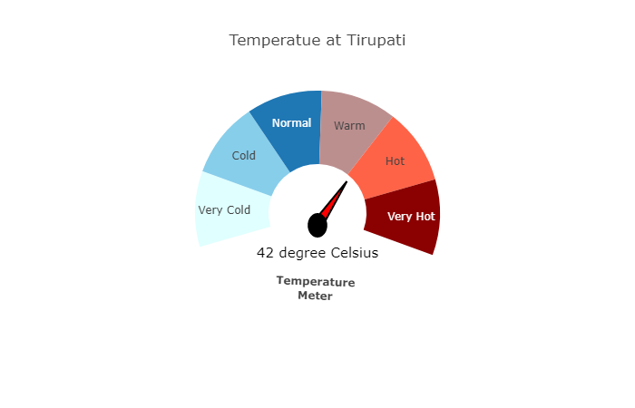

*Scatter*<br>
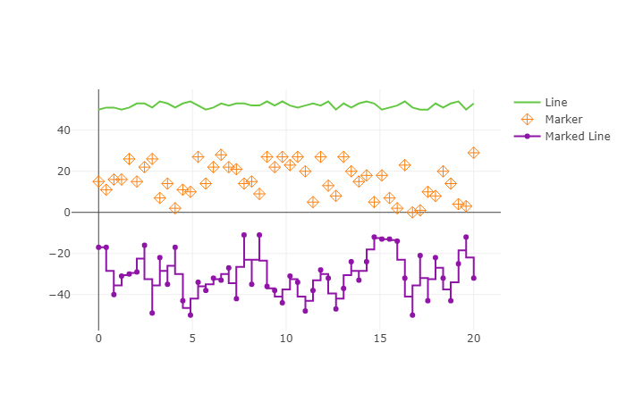

*Line*<br>
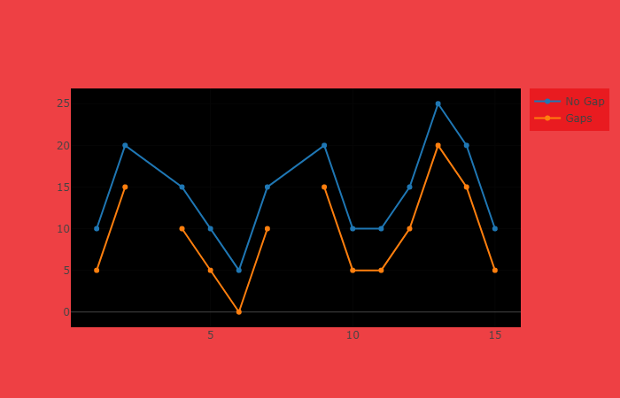

*Area*<br>
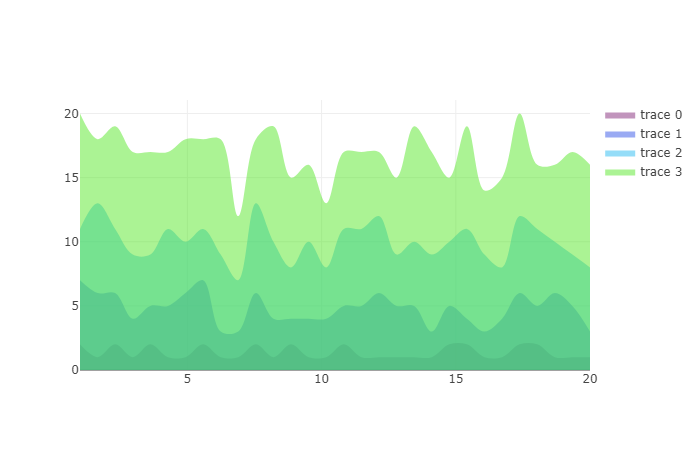

*Bar*<br>
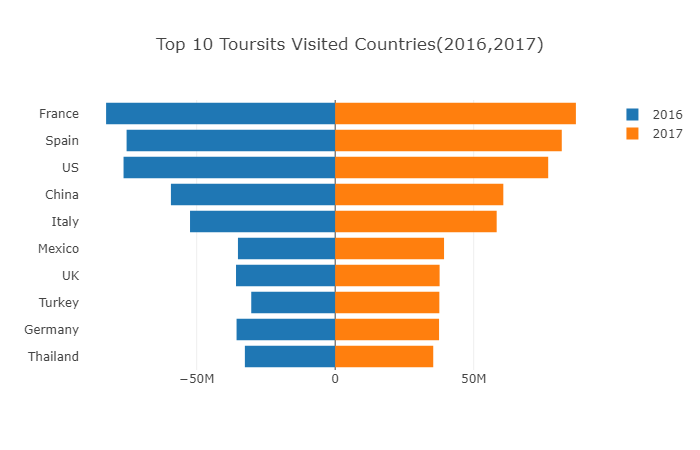
 
*Gantt Chart*<br>
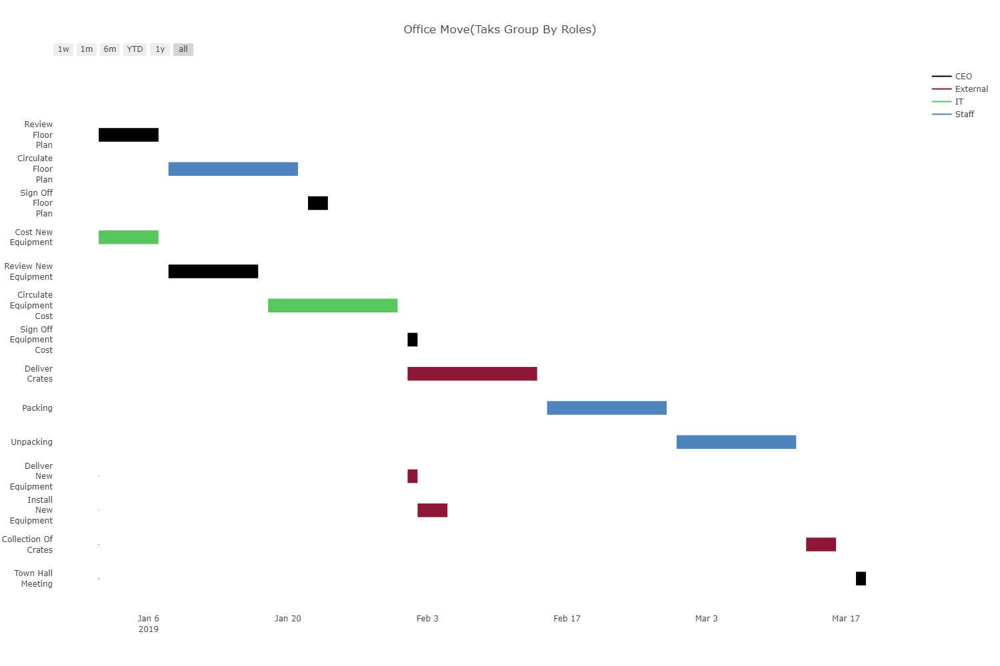

*Pie*<br>
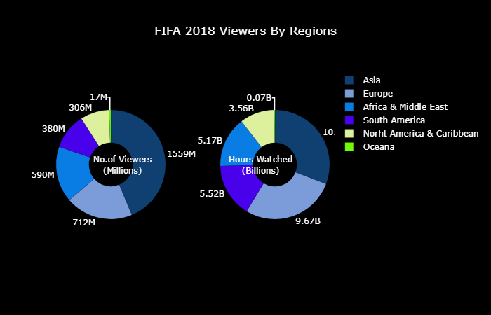

# Part 2
Plotly plots are extended with `plotly.figure_factory` for better plotting than vanill plotly.<br>

Import `figure_factory` as <br>
```import plotly.figure_factory as ff```

*Error*<br>
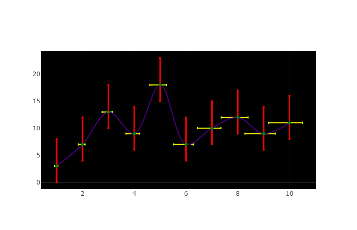

*Box*<br>
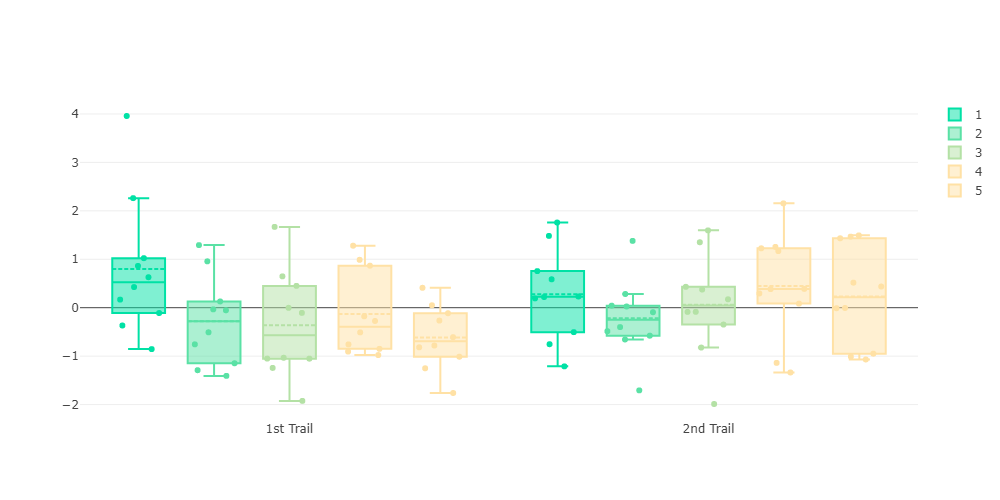

*Distribution*<br>
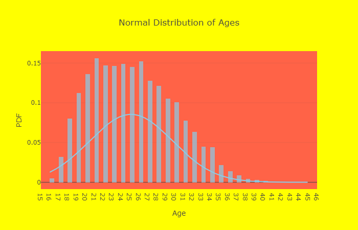

*Heatmap*<br>
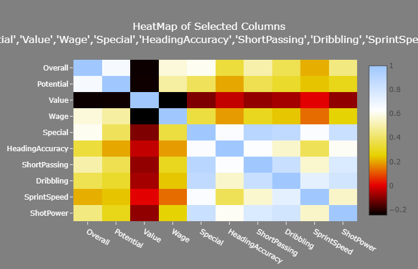

*Scatter Plot Matrix*<br>
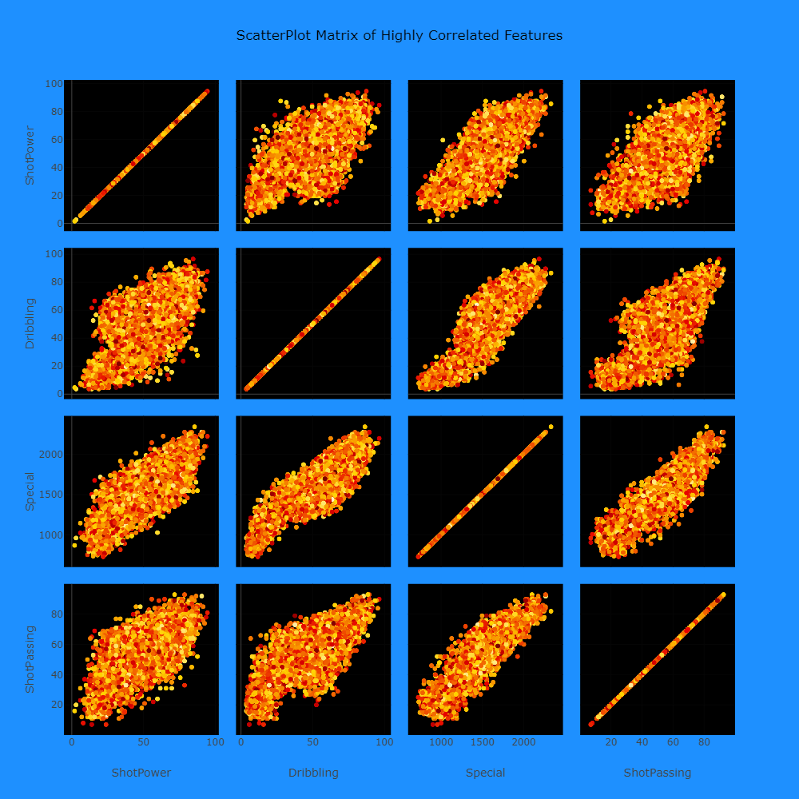

*2D-Density*<br>
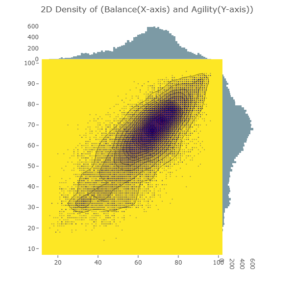

*Histogram Contour*<br>
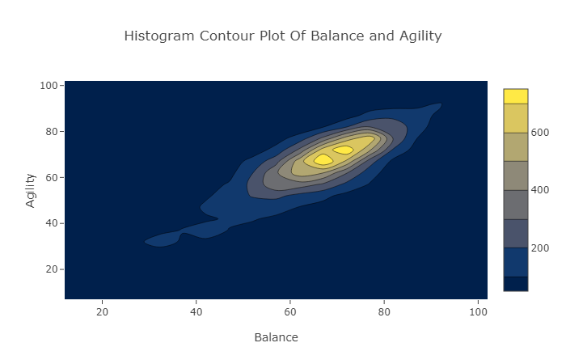
